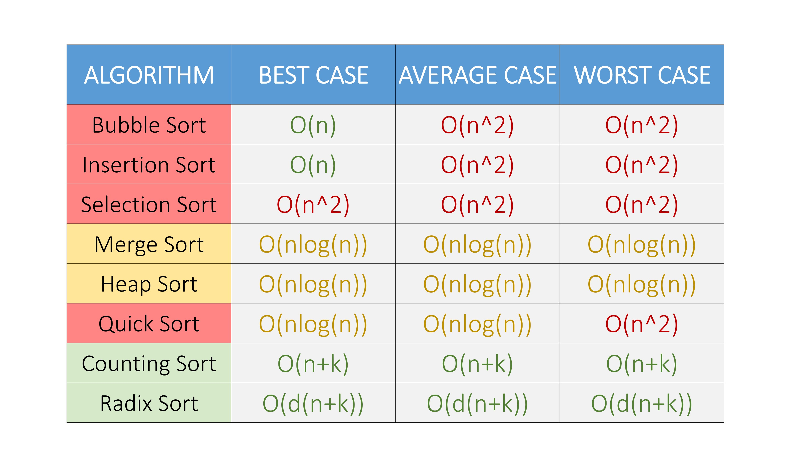

# JavaScript Algorithms and Data Structures


(The image is generated by a neural network [Kandinsky 3.1](https://www.sberbank.com/promo/kandinsky/)
with a prompt: "__javascript typescript algorithms and data structures__")

## To run any arbitrary js- or ts- script, type in the console

```shell
npm start filename.[ts|js]
```

## VS Code debugging for ts-files

If "imports" will not work in the compiled js-files, do the following:

1. package.json  :   change value of "module"-prop to "commonjs"
2. tsconfig.json :   change value of "module"-prop to "CommonJS"

## Useful links for the preparation to the interviews

1. [Sorting Algorithms Animations](https://www.toptal.com/developers/sorting-algorithms)
2. [Glassdoor microsoft questions](https://docs.google.com/document/d/11lLvIXcJw4Oi4mkqhWNO6uQe0Xwm-_Ej-OO73Qv_tWM/edit)
3. [React Interview Questions & Answers](https://github.com/sudheerj/reactjs-interview-questions)
4. [JavaScript algorithms](https://github.com/trekhleb/javascript-algorithms/blob/master/README.ru-RU.md)
5. [Geeks for Geeks. sSDE SHEET – A Complete Guide for SDE Preparation](https://www.geeksforgeeks.org/sde-sheet-a-complete-guide-for-sde-preparation/)
6. [datastructures-js](https://github.com/datastructures-js) - the javascript data structures project

## [Algorithm Visualizer](https://algorithm-visualizer.org/), an interactive online platform designed to bring algorithms to life through visualization

## [Visualization](https://eniac00.github.io/btv/) of the binary trees, presented in array-form

## [Visualization](https://algorithms.discrete.ma.tum.de/) of Graph Algorithms

## Complexity of sorting


## Work in progress on: lc-0092, lc-1334

## Test myself again on: lc-0330, lc-0658, lc-1579
